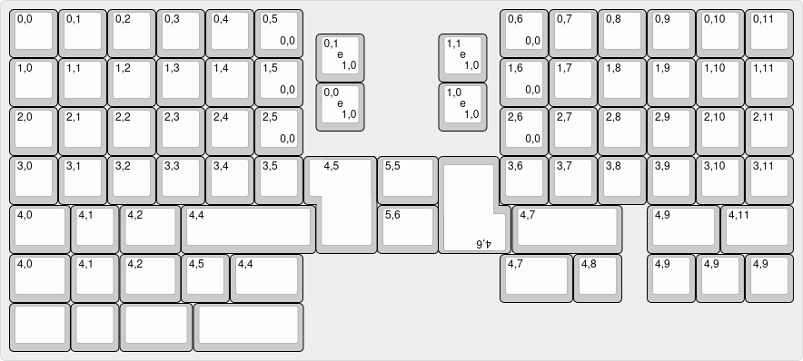

# Quasar-67
A Lumberjack Ortho keyboard for the kbd67-lite l

|| Measurements of Pcb and Plate cutouts are taken from Elmo's Drop-In replacement board:https://github.com/kb-elmo/67mk_E
---
### Current Status
- prototypes haven't been ordered yet, planned // 
- no plate to cover mid and create artwork with leds available, yet 
- no confirmation of fitting into a kbd67-lite yet // 
---
### Quasar-67: 
A quasar defines the center of a galaxy that emits a bright  light, creating the mirage that it is a larg star. However they are actually black holes which _emit_ light, due to th massive amount of amtter that sourrounds their event horizon, which they consume constantly. 
Being heavily inspired by the lumberjack [find it here](https://github.com/peej/lumberjack-keyboard) this keyboard aims to fit within the affordable kbd67-lite while getting rid of the present 60% keyboard it is.

To build one yourself, you'll need the pcb - files can be find in production/... - and a plate made of the material you prefer. All production files can be found within this repository. 

### Features: 
- Atmega32u4 
- Usb-C connector 
- short circuit protection to secure the board from electrical discharges and similiar. 
- cutouts for the kbd67-lite 
- two Iso-Enters for thumb cluster >> included in most base-kits 
- 5x6 cluster for both left and right side 
- layout options

---
### Images:

